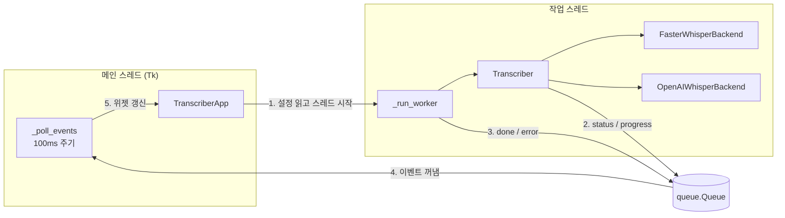

# BADA-Write
영상에서 텍스트를 받아쓰기

영상·음성 파일을 Whisper 계열 음성 인식 모델로 받아쓰는 데스크톱 GUI 앱이다. [faster-whisper](https://github.com/SYSTRAN/faster-whisper)와 [OpenAI Whisper](https://github.com/openai/whisper) 두 엔진 중 하나를 골라 쓸 수 있다. 모든 처리는 로컬에서 이루어지며, 파일이 외부 서버로 전송되지 않는다.


## 주요 기능

- 엔진 선택: faster-whisper(기본, 빠르고 환각이 적음) 또는 openai-whisper(원본 구현)
- 모델 선택 (`tiny` ~ `large-v3`, `turbo`) 및 언어 선택 (자동 감지 포함)
- 용어 힌트 입력으로 전문 용어 인식률 향상
- 반복·환각 억제 옵션 (같은 문장 반복, 무음 구간의 엉뚱한 문장 생성 감소)
- 실제 진행률 표시 진행바와 경과 시간 표시
- 구간별 타임스탬프 보기 토글 (재변환 없이 즉시 전환)
- 결과를 `txt`, `srt`, `vtt`, `tsv`, `json`으로 저장 (자막 파일 바로 생성 가능)
- 클립보드 복사, 결과창에서 직접 수정 후 저장
- 한 번 로드한 모델은 메모리에 유지되어 같은 설정으로 연속 변환 시 로딩 시간이 없다
- GPU(CUDA)를 자동으로 사용하며, GPU 라이브러리 문제로 실패하면 CPU로 자동 재시도한다

## 엔진 선택 가이드

| 항목 | faster-whisper (기본) | openai-whisper |
| --- | --- | --- |
| 추론 엔진 | CTranslate2 | PyTorch |
| 속도 | 수 배 빠름 | 기준 |
| 메모리 | 적게 사용 | 많이 사용 |
| 환각 억제 | VAD로 무음 구간 제거 | 무음 구간 결과 폐기 |
| ffmpeg | 불필요 (PyAV 내장) | 필수 |
| GPU 준비물 | cuBLAS, cuDNN 9 | CUDA 빌드 PyTorch |

같은 Whisper 가중치를 사용하므로 인식 정확도는 비슷하다. 특별한 이유가 없다면 faster-whisper를 쓰고, faster-whisper의 GPU 설정이 맞지 않는 환경에서는 openai-whisper를 쓴다. 앱은 설치된 엔진만 목록에 보여준다.

## 설치

### 1. 사전 요구 사항

| 항목 | 버전 | 비고 |
| --- | --- | --- |
| Python | 3.9 이상 | 3.10~3.12 권장 |
| tkinter | Python 동봉 | Linux는 별도 설치가 필요할 수 있다 |
| ffmpeg | 최신 | openai-whisper 엔진을 쓸 때만 필요하다 |

**tkinter 설치 (Linux만 해당)**

```bash
sudo apt install python3-tk
```

### 2. 저장소 클론 및 가상환경 구성

```bash
git clone https://github.com/jihoonkimtech/BADA-Write.git
cd BADA-Write

python -m venv .venv
# Windows
.venv\Scripts\activate
# macOS / Linux
source .venv/bin/activate
```

### 3. 패키지 설치

```bash
# faster-whisper 엔진만 설치 (기본)
pip install -e .

# openai-whisper 엔진도 함께 설치
pip install -e ".[openai]"
```

설치 없이 `pip install -r requirements.txt`만 하고 소스에서 바로 실행해도 된다.

### 4. GPU 설정 (선택)

CPU만으로도 동작하지만, NVIDIA GPU가 있으면 훨씬 빠르다. 사용하는 엔진에 맞춰 설정한다.

**faster-whisper**

CUDA 12용 cuBLAS와 cuDNN 9가 필요하다. 가장 간단한 방법은 pip으로 설치하는 것이다.

```bash
pip install nvidia-cublas-cu12 "nvidia-cudnn-cu12==9.*"
```

Windows에서는 앱이 실행될 때 위 패키지와 CUDA 빌드 PyTorch(설치된 경우)의 DLL 폴더를 자동으로 찾아 등록하므로 PATH를 직접 설정할 필요가 없다. RTX 50 시리즈는 CTranslate2 4.5.0 이상이 필요하다.

**openai-whisper**

`pip install openai-whisper`는 플랫폼 기본 PyTorch를 함께 설치한다. Windows의 기본 빌드는 CPU 전용이므로 CUDA 빌드 PyTorch로 바꿔야 한다. 정확한 명령어는 [PyTorch 설치 페이지](https://pytorch.org/get-started/locally/)에서 확인한다. RTX 50 시리즈는 CUDA 12.8 빌드(`cu128`)가 필요하다.

```bash
pip uninstall -y torch
pip install torch --index-url https://download.pytorch.org/whl/cu128
```

이미 CPU 빌드 torch가 설치되어 있으면 pip이 재설치하지 않으므로 반드시 먼저 제거한다. 설치 후 다음 명령으로 확인한다.

```bash
python -c "import torch; print(torch.__version__, torch.cuda.is_available())"
```

openai-whisper 엔진을 쓸 경우 ffmpeg도 설치한다.

```bash
# Windows
winget install Gyan.FFmpeg
# macOS
brew install ffmpeg
# Ubuntu / Debian
sudo apt install ffmpeg
```

## 사용법

### 실행

```bash
# pip install -e . 로 설치한 경우
whisper-transcriber

# 또는 모듈로 실행
python -m whisper_transcriber
```

설치 없이 소스에서 실행할 때는 저장소 루트에서 `src`를 경로에 추가한다.

```powershell
# Windows PowerShell
$env:PYTHONPATH="src"; python -m whisper_transcriber
```

```bash
# macOS / Linux
PYTHONPATH=src python -m whisper_transcriber
```

### 화면 사용 순서

1. **파일 찾기**로 변환할 영상 또는 음성 파일을 선택한다.
2. **엔진**, **모델**, **언어**를 고른다. 언어를 알고 있다면 직접 지정하는 편이 정확하고 빠르다.
3. 강의처럼 전문 용어가 많은 영상이라면 **용어 힌트**에 자주 나오는 단어를 쉼표로 구분해 입력한다. (예: `축전기, 전하, 전압, 전류, 기전력, 시상수`)
4. **반복·환각 억제**는 기본으로 켜져 있다. 문장 연결이 어색하게 끊긴다면 끄고 다시 돌려 비교한다.
5. **받아쓰기 시작**을 누른다. 처음 쓰는 모델은 자동으로 다운로드되므로 시간이 더 걸린다.
6. 완료되면 결과가 표시된다. **타임스탬프 표시**를 켜면 구간별 시간이 함께 나온다.
7. **복사** 또는 **파일로 저장**으로 결과를 내보낸다. 저장 시 확장자(`.txt`, `.srt` 등)에 따라 형식이 결정된다. `.txt`는 결과창에 보이는 내용을 그대로 저장하므로, 결과창에서 직접 고친 내용도 반영된다.

오류가 나면 상태줄에 요약이 표시되고, 결과창에 전체 오류 내용이 출력된다. 이슈를 등록할 때는 결과창 내용을 복사해 첨부한다.

### 용어 힌트 동작 방식

Whisper는 디코딩할 때 "앞서 나온 말"을 프롬프트로 받는다. 용어 힌트를 이 프롬프트에 넣으면, 발음이 비슷한 후보 중 힌트에 있는 단어를 고를 확률이 높아진다. 예를 들어 "전하"가 "전화"로, "전류"가 "졸류"로 잘못 인식되는 경우를 줄일 수 있다.

- faster-whisper는 `hotwords`로 전달하며, 모든 30초 구간에 적용된다.
- openai-whisper는 `initial_prompt`로 전달한다. 기본 동작은 첫 30초 구간에만 적용되므로, 20250625 이상 버전에서는 `carry_initial_prompt`를 함께 켜서 모든 구간에 적용한다.
- 힌트가 너무 길면 앞부분이 잘리므로 핵심 단어 10~20개 이내로 입력한다.
- 영상에 없는 단어를 넣으면 오히려 그 단어가 잘못 끼어들 수 있다.

### 반복·환각 억제 동작 방식

Whisper는 앞 구간에서 받아쓴 문장을 다음 구간의 문맥으로 넘긴다. 한 구간을 잘못 받아쓰면 그 오류가 다음 구간으로 이어져 같은 문장이 계속 반복된다. 또 판서처럼 말이 없는 구간에서는 학습 데이터에 있던 엉뚱한 문장을 만들어내기도 한다.

| 엔진 | 적용 옵션 |
| --- | --- |
| faster-whisper | `vad_filter=True`(음성 구간만 인식), `condition_on_previous_text=False`(이전 문장 연쇄 차단) |
| openai-whisper | `condition_on_previous_text=False`, `hallucination_silence_threshold=2.0`(2초 이상 무음 구간의 의심 결과 폐기, 단어 단위 타임스탬프 계산이 필요해 조금 느려진다) |

이전 문장을 문맥으로 쓰지 않으므로 문장 부호나 표기가 구간마다 조금씩 달라질 수 있다. 용어 힌트는 이 옵션과 상관없이 계속 적용된다.

### 모델 선택 가이드

수치는 Whisper 공식 README 기준 대략적인 값이며, 속도는 `large` 대비 상대 속도이다. faster-whisper는 같은 모델에서 더 빠르고 메모리를 덜 쓴다.

| 모델 | 필요 VRAM | 상대 속도 | 추천 용도 |
| --- | --- | --- | --- |
| `tiny` | ~1 GB | ~10x | 빠른 확인용, 정확도 낮음 |
| `base` | ~1 GB | ~7x | 저사양 PC |
| `small` | ~2 GB | ~4x | CPU 환경 |
| `medium` | ~5 GB | ~2x | 한국어 품질과 속도의 균형 |
| `turbo` | ~6 GB | ~8x | 기본값. large-v3의 디코더를 줄인 모델이라 빠르지만 한국어 전문 용어 정확도는 large-v3보다 낮다 |
| `large-v3` | ~10 GB | 1x | 최고 정확도. 반복·환각이 상대적으로 많아 억제 옵션과 함께 쓰는 것을 권장한다 |

CPU만 있는 환경에서 `medium` 이상은 영상 길이보다 오래 걸릴 수 있다. 모델은 처음 사용할 때 자동으로 다운로드되며, faster-whisper는 `~/.cache/huggingface`, openai-whisper는 `~/.cache/whisper`에 저장된다.

## 동작 원리

### Whisper 처리 과정

1. **디코딩**: 입력 파일에서 오디오 트랙만 추출해 16kHz 모노 PCM으로 변환한다. faster-whisper는 PyAV(ffmpeg 라이브러리 내장)를, openai-whisper는 외부 ffmpeg 프로그램을 사용한다. 영상 파일도 그대로 넣을 수 있는 이유이다.
2. **VAD (faster-whisper, 억제 옵션 사용 시)**: Silero VAD 모델이 음성이 있는 구간만 골라내고 무음 구간은 인식 대상에서 뺀다.
3. **스펙트로그램 변환**: 오디오를 30초 단위 윈도우로 잘라 log-Mel 스펙트로그램으로 바꾼다.
4. **인코더-디코더 추론**: Transformer 인코더가 스펙트로그램을 특징 벡터로 만들고, 디코더가 텍스트 토큰과 타임스탬프 토큰을 순서대로 생성한다. 이때 용어 힌트와 이전 구간 문장이 프롬프트로 함께 들어간다.
5. **윈도우 이동**: 마지막으로 예측된 타임스탬프 위치로 윈도우를 옮기며 파일 끝까지 반복한다. 이 과정에서 `segments`(구간별 시작·끝 시간과 텍스트)가 만들어진다.

언어를 `자동 감지`로 두면 첫 30초로 언어를 추정한 뒤 진행한다.

### 앱 구조

GUI, 실행 관리, 엔진, 결과 저장을 분리했다. GUI는 엔진 종류를 모르고, 엔진은 GUI를 모른다.



- **스레드 분리**: 변환은 수 분 이상 걸리므로 작업 스레드에서 실행한다. 메인 스레드가 막히면 창이 "응답 없음" 상태가 된다.
- **큐 기반 통신**: Tkinter 위젯은 스레드 안전하지 않다. 작업 스레드는 위젯을 직접 건드리지 않고 `queue.Queue`에 이벤트만 넣으며, 메인 스레드가 100ms마다 큐를 비우며 화면을 갱신한다.
- **엔진 추상화**: 두 엔진은 같은 인터페이스(`detect_device`, `load`, `run`)를 구현하고, 결과를 같은 형식(`text`, `segments`, `language`)으로 돌려준다. 그래서 저장, 타임스탬프 표시 등은 엔진과 상관없이 동작한다.
- **진행률 계산**: faster-whisper는 구간을 하나씩 생성하므로 `구간 끝 시각 / 전체 길이`로 계산한다. openai-whisper는 진행률 콜백이 없어서, 변환하는 동안에만 내부 `tqdm` 진행바를 콜백 호출 객체로 바꾸고 끝나면 복원한다.
- **GPU 호환성 처리**: openai-whisper는 실행 전에 GPU 세대가 설치된 PyTorch에서 지원되는지 확인한다. 두 엔진 모두 GPU 라이브러리 오류(cuBLAS, cuDNN 로드 실패 등)가 나면 CPU로 한 번 더 시도한다.
- **모델 캐시**: 마지막으로 쓴 모델을 메모리에 유지하고, 엔진, 모델, 장치 중 하나가 바뀔 때만 다시 로드한다.
- **지연 import**: 엔진 라이브러리는 import에만 수 초가 걸리므로 실제 변환 시점에 불러와 창이 바로 뜨게 했다.

### 디렉터리 구조

```
BADA-Write/
├── src/whisper_transcriber/
│   ├── __init__.py      # 버전 정보
│   ├── __main__.py      # python -m 진입점
│   ├── app.py           # Tkinter GUI (화면, 이벤트 처리)
│   ├── engine.py        # 실행 관리 (엔진 선택, 모델 캐시, GPU 실패 시 CPU 재시도)
│   ├── backends.py      # faster-whisper / openai-whisper 엔진 구현
│   └── writers.py       # txt, srt, vtt, tsv, json 저장
├── tests/
│   ├── test_engine.py   # 모델 다운로드 없이 도는 엔진 테스트
│   └── test_writers.py  # 저장 형식 테스트
├── docs/
│   └── screenshot.png
├── LICENSE              # MIT
├── pyproject.toml       # 패키지 메타데이터, 실행 명령 등록
├── requirements.txt
├── requirements-dev.txt
└── README.md
```

## 개발

```bash
pip install -e ".[dev]"
pytest
```

테스트는 가짜 모델로 엔진 로직(옵션 전달, 진행률, GPU 실패 시 CPU 재시도, 모델 캐시, 저장 형식)을 검증하므로 모델 다운로드나 GPU가 필요 없다. 두 엔진의 실제 함수 시그니처와 옵션이 맞는지 확인하는 테스트가 있어 `dev` 설치 시 두 엔진이 모두 설치된다.

## 문제 해결

| 증상 | 원인 및 해결 |
| --- | --- |
| 엔진 목록에 `(설치된 엔진 없음)` 표시 | 엔진 패키지가 없다. `pip install -e .`로 faster-whisper를 설치한다. |
| `cublas64_12.dll is not found` 등 DLL 오류 | faster-whisper의 GPU 라이브러리가 없다. 설치 4단계의 `nvidia-cublas-cu12`, `nvidia-cudnn-cu12`를 설치한다. 앱은 이 경우 CPU로 자동 재시도한다. |
| `no kernel image is available for execution on the device` | 설치된 PyTorch가 GPU 세대를 지원하지 않는다. RTX 50 시리즈라면 `cu128` 빌드로 재설치한다. |
| `ffmpeg를 찾을 수 없습니다` | openai-whisper 엔진에만 필요하다. ffmpeg를 설치하거나 faster-whisper 엔진을 쓴다. |
| `No module named 'tkinter'` | Linux에서 `sudo apt install python3-tk`를 실행한다. |
| `CUDA out of memory` | VRAM이 부족하다. 더 작은 모델을 선택한다. |
| 첫 실행이 유난히 느림 | 모델 다운로드 중이다. 이후 실행부터는 캐시를 사용한다. |
| 같은 문장이 반복되거나 엉뚱한 외국어 문장이 섞임 | Whisper의 알려진 환각 현상이다. **반복·환각 억제**를 켜고, 언어를 직접 지정한다. |
| 전문 용어가 비슷한 발음의 다른 단어로 나옴 | **용어 힌트**에 해당 단어를 추가하고, 가능하면 `large-v3`를 쓴다. |

## 알려진 제한

- 변환 도중 중단 기능이 없다. 변환 중 창을 닫으면 확인 후 강제 종료된다.
- 한 번에 파일 하나만 처리한다.

## 라이선스

[MIT License](LICENSE)로 배포한다.

사용한 외부 구성 요소의 라이선스는 다음과 같다.

- [faster-whisper](https://github.com/SYSTRAN/faster-whisper): MIT
- [OpenAI Whisper](https://github.com/openai/whisper): MIT
