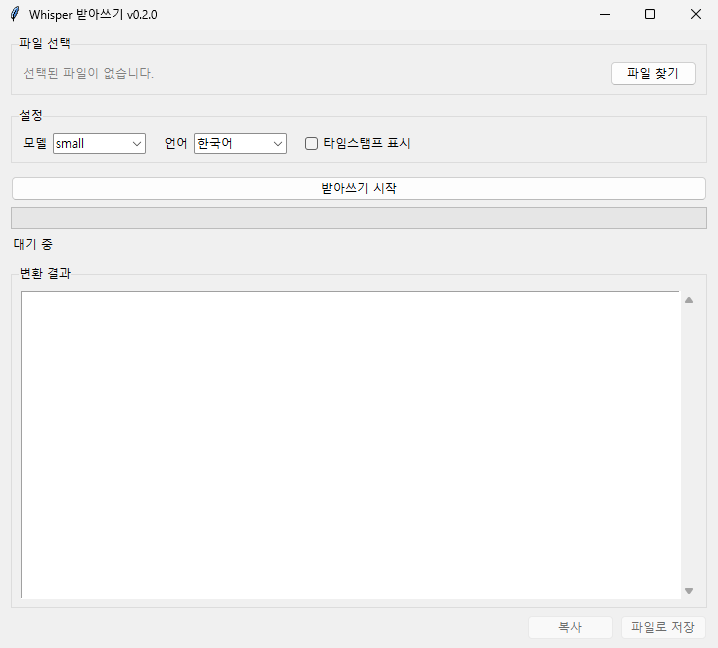
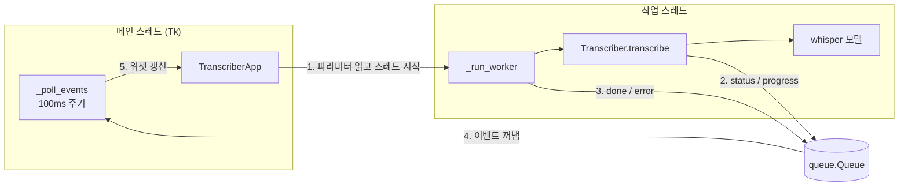

# BADA-Write
영상에서 텍스트를 받아쓰기
영상·음성 파일을 [OpenAI Whisper](https://github.com/openai/whisper)로 받아쓰는 데스크톱 GUI 앱이다. 모든 처리는 로컬에서 이루어지며, 파일이 외부 서버로 전송되지 않는다.



## 주요 기능

- mp4, mkv, mov, mp3, wav, m4a 등 ffmpeg가 읽을 수 있는 대부분의 미디어 파일 지원
- 모델 선택 (`tiny` ~ `large-v3`, `turbo`) 및 언어 선택 (자동 감지 포함)
- 실제 진행률 표시 진행바와 경과 시간 표시
- 구간별 타임스탬프 보기 토글 (재변환 없이 즉시 전환)
- 결과를 `txt`, `srt`, `vtt`, `tsv`, `json`으로 저장 (자막 파일 바로 생성 가능)
- 클립보드 복사
- 한 번 로드한 모델은 메모리에 유지되어 같은 모델로 연속 변환 시 로딩 시간이 없다
- GPU(CUDA)가 있으면 자동으로 사용한다

## 설치

### 1. 사전 요구 사항

| 항목 | 버전 | 비고 |
| --- | --- | --- |
| Python | 3.9 이상 | 3.10~3.12 권장 |
| ffmpeg | 최신 | Whisper가 미디어 디코딩에 사용한다 |
| tkinter | Python 동봉 | Linux는 별도 설치가 필요할 수 있다 |

**ffmpeg 설치**

```bash
# Windows (둘 중 하나)
winget install Gyan.FFmpeg
choco install ffmpeg

# macOS
brew install ffmpeg

# Ubuntu / Debian
sudo apt update && sudo apt install ffmpeg
```

설치 후 터미널에서 `ffmpeg -version`이 동작하는지 확인한다. Windows에서 winget으로 설치했다면 터미널을 새로 열어야 PATH가 반영된다.

**tkinter 설치 (Linux만 해당)**

```bash
sudo apt install python3-tk
```

### 2. 저장소 클론 및 가상환경 구성

```bash
git clone https://github.com/jihoonkimtech/whisper-transcriber.git
cd whisper-transcriber

python -m venv .venv
# Windows
.venv\Scripts\activate
# macOS / Linux
source .venv/bin/activate
```

### 3. GPU 사용 시: PyTorch 먼저 설치 (선택)

`pip install openai-whisper`는 플랫폼 기본 PyTorch를 함께 설치한다. Windows의 기본 빌드는 CPU 전용이므로 NVIDIA GPU를 쓰려면 Whisper보다 **먼저** CUDA 빌드 PyTorch를 설치해야 한다. 정확한 명령어는 [PyTorch 설치 페이지](https://pytorch.org/get-started/locally/)에서 본인 환경을 선택해 확인한다. 예시는 다음과 같다.

```bash
pip install torch --index-url https://download.pytorch.org/whl/cu124
```

GPU 인식 여부는 다음 명령으로 확인한다.

```bash
python -c "import torch; print(torch.cuda.is_available())"
```

### 4. 패키지 설치

```bash
pip install -e .
```

`requirements.txt`만 설치하고 소스에서 바로 실행해도 된다.

```bash
pip install -r requirements.txt
```

## 사용법

### 실행

```bash
# pip install -e . 로 설치한 경우
whisper-transcriber

# 또는 모듈로 실행
python -m whisper_transcriber

# 설치 없이 소스에서 실행 (저장소 루트 기준)
PYTHONPATH=src python -m whisper_transcriber
```

Windows PowerShell에서 소스 실행 시에는 `$env:PYTHONPATH="src"; python -m whisper_transcriber`를 사용한다.

### 화면 사용 순서

1. **파일 찾기**로 변환할 영상 또는 음성 파일을 선택한다.
2. **모델**과 **언어**를 고른다. 언어를 알고 있다면 직접 지정하는 편이 정확하고 빠르다.
3. **받아쓰기 시작**을 누른다. 처음 쓰는 모델은 자동으로 다운로드되므로 시간이 더 걸린다.
4. 완료되면 결과가 표시된다. **타임스탬프 표시**를 켜면 구간별 시간이 함께 나온다.
5. **복사** 또는 **파일로 저장**으로 결과를 내보낸다. 저장 시 확장자(`.txt`, `.srt` 등)에 따라 형식이 결정된다.

### 모델 선택 가이드

수치는 Whisper 공식 README 기준 대략적인 값이며, 속도는 `large` 대비 상대 속도이다.

| 모델 | 필요 VRAM | 상대 속도 | 추천 용도 |
| --- | --- | --- | --- |
| `tiny` | ~1 GB | ~10x | 빠른 확인용, 정확도 낮음 |
| `base` | ~1 GB | ~7x | 저사양 PC |
| `small` | ~2 GB | ~4x | CPU 환경 기본값 |
| `medium` | ~5 GB | ~2x | 한국어 품질과 속도의 균형 |
| `turbo` | ~6 GB | ~8x | GPU 환경 추천, large급 정확도에 빠른 속도 |
| `large-v3` | ~10 GB | 1x | 최고 정확도 |

CPU만 있는 환경에서 `medium` 이상은 영상 길이보다 오래 걸릴 수 있다. 다운로드된 모델은 `~/.cache/whisper`에 저장된다.

## 동작 원리

### Whisper 처리 과정

1. **디코딩**: ffmpeg가 입력 파일에서 오디오 트랙만 추출해 16kHz 모노 PCM으로 변환한다. 영상 파일도 그대로 넣을 수 있는 이유이다.
2. **스펙트로그램 변환**: 오디오를 30초 단위 윈도우로 잘라 log-Mel 스펙트로그램으로 바꾼다.
3. **인코더-디코더 추론**: Transformer 인코더가 스펙트로그램을 특징 벡터로 만들고, 디코더가 텍스트 토큰과 타임스탬프 토큰을 순서대로 생성한다.
4. **윈도우 이동**: 마지막으로 예측된 타임스탬프 위치로 윈도우를 옮기며 파일 끝까지 반복한다. 이 과정에서 `segments`(구간별 시작·끝 시간과 텍스트)가 만들어진다.

언어를 `자동 감지`로 두면 첫 30초로 언어를 추정한 뒤 진행한다.

### 앱 구조

GUI와 변환 엔진을 분리해 엔진을 GUI 없이 테스트하고 재사용할 수 있게 했다.



- **스레드 분리**: 변환은 수 분 이상 걸리므로 작업 스레드에서 실행한다. 메인 스레드가 막히면 창이 "응답 없음" 상태가 된다.
- **큐 기반 통신**: Tkinter 위젯은 스레드 안전하지 않다. 작업 스레드는 위젯을 직접 건드리지 않고 `queue.Queue`에 이벤트만 넣으며, 메인 스레드가 100ms마다 큐를 비우며 화면을 갱신한다.
- **진행률 계산**: Whisper는 진행률 콜백을 제공하지 않고 내부적으로 `tqdm` 진행바만 쓴다. 엔진은 변환하는 동안에만 `whisper.transcribe` 모듈의 `tqdm` 참조를 콜백을 호출하는 대체 객체로 바꾸고, 끝나면 원래대로 복원한다.
- **모델 캐시**: 마지막으로 쓴 모델을 메모리에 유지하고, 모델이나 장치가 바뀔 때만 다시 로드한다.
- **지연 import**: `torch`와 `whisper`는 import에만 수 초가 걸리므로 실제 변환 시점에 불러와 창이 바로 뜨게 했다.

### 디렉터리 구조

```
whisper-transcriber/
├── src/whisper_transcriber/
│   ├── __init__.py      # 버전 정보
│   ├── __main__.py      # python -m 진입점
│   ├── app.py           # Tkinter GUI (화면, 이벤트 처리)
│   └── engine.py        # 변환 엔진 (모델 캐시, 진행률, 결과 저장)
├── tests/
│   └── test_engine.py   # 모델 다운로드 없이 도는 엔진 테스트
├── docs/
│   └── screenshot.png
├── LICENSE              # MIT
├── pyproject.toml       # 패키지 메타데이터, 실행 명령 등록
├── requirements.txt
├── requirements-dev.txt
└── README.md
```

## 개발

```bash
pip install -e ".[dev]"
pytest
```

테스트는 가짜 모델로 엔진 로직(진행률 전달, tqdm 복원, 모델 캐시, 결과 저장 형식)을 검증하므로 모델 다운로드나 GPU가 필요 없다.

## 문제 해결

| 증상 | 원인 및 해결 |
| --- | --- |
| `ffmpeg를 찾을 수 없습니다` | ffmpeg 미설치 또는 PATH 미등록이다. 설치 후 터미널을 새로 연다. |
| `No module named 'tkinter'` | Linux에서 `sudo apt install python3-tk`를 실행한다. |
| GPU가 있는데 상태에 `CPU`로 표시됨 | CPU 빌드 PyTorch가 설치된 상태이다. 설치 3단계를 참고해 CUDA 빌드로 재설치한다. |
| `CUDA out of memory` | VRAM이 부족하다. 더 작은 모델을 선택한다. |
| 첫 실행이 유난히 느림 | 모델 다운로드 중이다. 이후 실행부터는 캐시를 사용한다. |
| 같은 문장이 반복 출력됨 | Whisper의 알려진 환각 현상이다. 긴 무음 구간에서 자주 발생하며, 더 큰 모델을 쓰거나 언어를 직접 지정하면 줄어든다. |

## 알려진 제한

- Whisper는 변환 도중 중단 기능을 제공하지 않는다. 변환 중 창을 닫으면 확인 후 강제 종료된다.
- 한 번에 파일 하나만 처리한다.

## 라이선스

라이선스를 아직 정하지 않았다. 배포 전 `LICENSE` 파일을 추가한다. 이 앱이 사용하는 Whisper는 MIT 라이선스이다.
